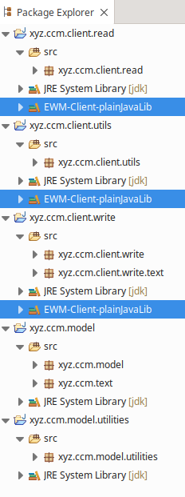

# Build

## Eclipse Repository

This Github repository is the content of an Eclipse workspace. Start by creating an Eclipse workspace with the EWM Client that matches your EWM server. Use your file manager or console to go there and `git clone`.

The main programs (`xyz.ccm.client.read` and `xyz.ccm.client.write`) use the EWM Java API ("Plain Java Client Libraries").

## EWM Java Client Libraries

Each program will connect to a specific version of EWM. For this needed version of EWM:

* go to <https://jazz.net/downloads/workflow-management>
* click the version of EWM you will connect to
* download the "Plain Java Client Libraries"
* unzip (somewhere else than in the workspace).

For each Eclipse project needing the Plain Java Client Libraries, beware you cant use different versions of the Plain Java Client Libraries; if you need that, you’ll have to duplicate the projects or, easier, to create a copy of the entire workspace.
  
Don’t try to use a version of the API different from the version of EWM you want to connect to, this won’t work.



You will have to change your Eclipse project properties if this above doesn’t match your local installation (or if you are working on a non-UNIX plaform).

## Build a program

Richt-click a "main" source file like `xyz/ccm/client/read/Read.java` and:

* "Export..."
* "Java" > "Runnable JAR file"
* "Next >"
* Export destination: `/home/xyz/dev/ccm-clients/Read702.jar` (example)
* Library handling: "Package required libraries into generated JAR"
* "Finish"

## Run a program

Use the same JRE, for example:

```
/opt/Jazz/EWMClient-7.0.2SR1/jdk/bin/java  -jar /home/xyz/dev/ccm-clients/Read702.jar
```


